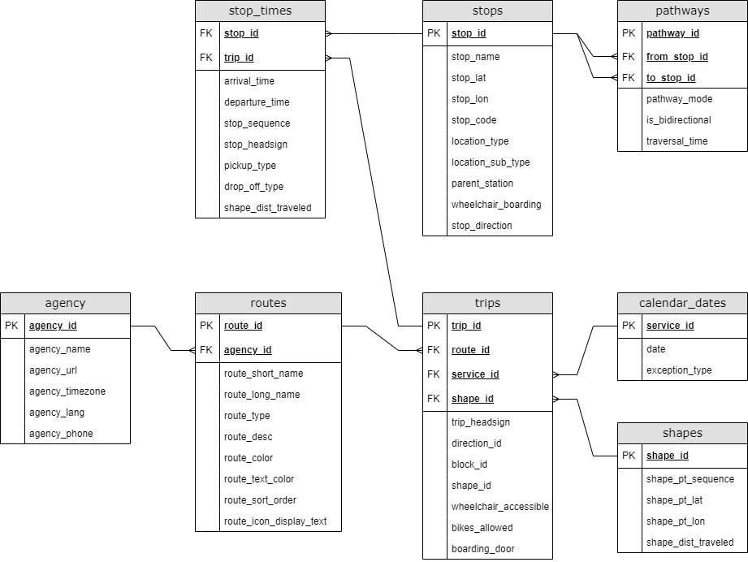

# GTFS

## Chart

## Mapping
| Variable name              | Original table | Original name         |
|----------------------------|----------------|-----------------------|
| agency_name                | agency         | agency_name           |
| route_name                 | routes         | route_short_name      |
| route_type                 | routes         | route_type            |
| route_desc                 | routes         | route_desc            |
| trip_id                    | trips          | trip_id               |
| trip_direction             | trips          | direction_id          |
| trip_wheelchair_accessible | trips          | wheelchair_accessible |
| trip_bikes_allowed         | trips          | bikes_allowed         |
| trip_boarding_door         | trips          | boarding_door         |
| stop_arrival_time          | stop_times     | arrival_time          |
| stop_departure_time        | stop_times     | departure_time        |
| stop_id                    | stops          | stop_id               |
| stop_name                  | stops          | stop_name             |
| stop_latitude              | stops          | stop_lat              |
| stop_longitude             | stops          | stop_lon              |
| stop_location_type         | stops          | location_type         |
| stop_wheelchair_boarding   | stops          | wheelchair_boarding   |

## Dictionary

| Variable                  | Variable name              | Measurement unit | Allowed values                                                      | Description                                                            |
|---------------------------|----------------------------|------------------|---------------------------------------------------------------------|------------------------------------------------------------------------|
| Agency name               | agency_name                | Text             |                                                                     | Full name of the transit agency.                                       |
| Route name                | route_name                 | Text             |                                                                     | Short name of a route.                                                 |
| Route type                | route_type                 | Numeric          | 0 - tram, 1 - metro, 3 - bus, 4 - ferry, 11 - trolleybus, 109 - hev | Indicates the type of transportation used on a route.                  |
| Route description         | route_desc                 | Text             |                                                                     | Description of the route                                               |
| Trip ID                   | trip_id                    | Text             |                                                                     | Identifies a trip.                                                     |
| Trip direction            | trip_direction             | Numeric          | 0 - normal, 1 - opposite                                            | Indicates the direction of travel for a trip.                          |
| Wheelchair accessible     | trip_wheelchair_accessible | Numeric          | 0 - unknown, 1 - yes, 2 - no                                        | Indicates wheelchair accessibility.                                    |
| Bikes allowed             | trip_bikes_allowed         | Numeric          | 0 - unknown, 1 - yes, 2 - no                                        | Indicates whether bikes are allowed.                                   |
| Boarding door             | trip_boarding_door         | Numeric          | 0 - any, 2 - front door only                                        | Indicates whether on which door can be board.                          |
| Arrival time              | stop_arrival_time          | HH:MM:SS         |                                                                     | Arrival time at a specific stop for a specific trip on a route.        |
| Departure time            | stop_departure_time        | HH:MM:SS         |                                                                     | Departure time from a specific stop for a specific trip on a route.    |
| Stop ID                   | stop_id                    | Text             |                                                                     | Identifies a stop, station, or station entrance.                       |
| Stop name                 | stop_name                  | Text             |                                                                     | Name of the location.                                                  |
| Stop location (latitude)  | stop_latitude              | Numeric          | -90 - +90                                                           | Latitude of the location.                                              |
| Stop location (longitude) | stop_longitude             | Numeric          | -180 - +180                                                         | Longitude of the location.                                             |
| Stop location type        | stop_location_type         | Numeric          | 0 - stop, 1 - station, 2 - entrance/exit                            | Type of the location                                                   |
| Wheelchair boarding       | stop_wheelchair_boarding   | Numeric          | 0 - unknown, 1 - yes, 2 - no                                        | Indicates whether wheelchair boardings are possible from the location. |

| Változó                    | Változó neve               | Típus    | Megengedett értékek                                                 | Leírás                                                                |
|----------------------------|----------------------------|----------|---------------------------------------------------------------------|-----------------------------------------------------------------------|
| Szolgáltató neve           | agency_name                | Szöveges |                                                                     | A szolgáltató teljes neve.                                            |
| Járat neve                 | route_name                 | Szöveges |                                                                     | Az járat rövid neve.                                                  |
| Járat típusa               | route_type                 | Szám     | 0 - villamos, 1 - metró, 2 - busz, 3 - hajó, 4 - trolibusz, 5 - hév | A járatot kiszolgáló jármű típusa.                                    |
| Járat leírása              | route_desc                 | Szöveges |                                                                     | A járat rövid leírása.                                                |
| Útvonal azonosítója        | trip_id                    | Szöveges |                                                                     | Két megálló közötti utazás azonosítója.                               |
| Útvonal iránya             | trip_direction             | Szám     | 0 - normál, 1 - ellentétes                                          | Az utazás menetirányát jelzi.                                         |
| Kerekesszékkel elérhető    | trip_wheelchair_accessible | Szám     | 0 - ismeretlen, 1 - igen, 2 - nem                                   | Azt jelzi, hogy a járaton kerekesszékkel lehetséges-e utazni.         |
| Kerékpárok engedélyezettek | trip_bikes_allowed         | Szám     | 0 - ismeretlen, 1 - igen, 2 - nem                                   | Azt jelzi, hogy megengedett-e a kerékpár szállítás.                   |
| Beszálló ajtó              | trip_boarding_door         | Szám     | 0 - bármelyik, 1 - első ajtó                                        | Azt jelzi, hogy melyik ajtón lehet-e felszállni.                      |
| Érkezési idő               | stop_arrival_time          | HH:MM:SS |                                                                     | Érkezési idő egy adott megállóhelyen egy adott utazáshoz.             |
| Indulási idő               | stop_departure_time        | HH:MM:SS |                                                                     | Indulási idő egy adott megállóból egy adott utazáshoz.                |
| Megálló azonosítója        | stop_id                    | Szöveges |                                                                     | Megállóhelyet, állomást vagy állomás bejáratát azonosítja.            |
| Megálló neve               | stop_name                  | Szöveges |                                                                     | A megálló neve.                                                       |
| Megálló helye (szélesség)  | stop_latitude              | Szám     | -90 - +90                                                           | A megálló koordinátájának szélességi foka.                            |
| Megálló helye (hosszúság)  | stop_longitude             | Szám     | -180 - +180                                                         | A megálló kordinátájának hosszúsági foka.                             |
| Megálló típusa             | stop_location_type         | Szám     | 0 - megálló, 1 - állomás, 2 - állomás bejárat/kijárat               | A megálló típusa.                                                     |
| Kerekesszékes beszállás    | stop_wheelchair_boarding   | Szám     | 0 - ismeretlen, 1 - igen, 2 - nem                                   | Azt jelzi, hogy a megállóból lehetséges-e a kerekesszékes felszállás. |
